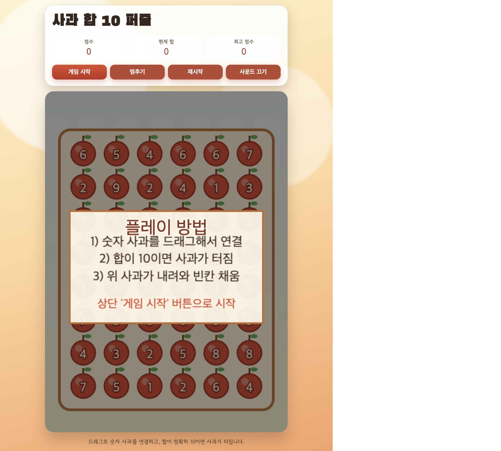
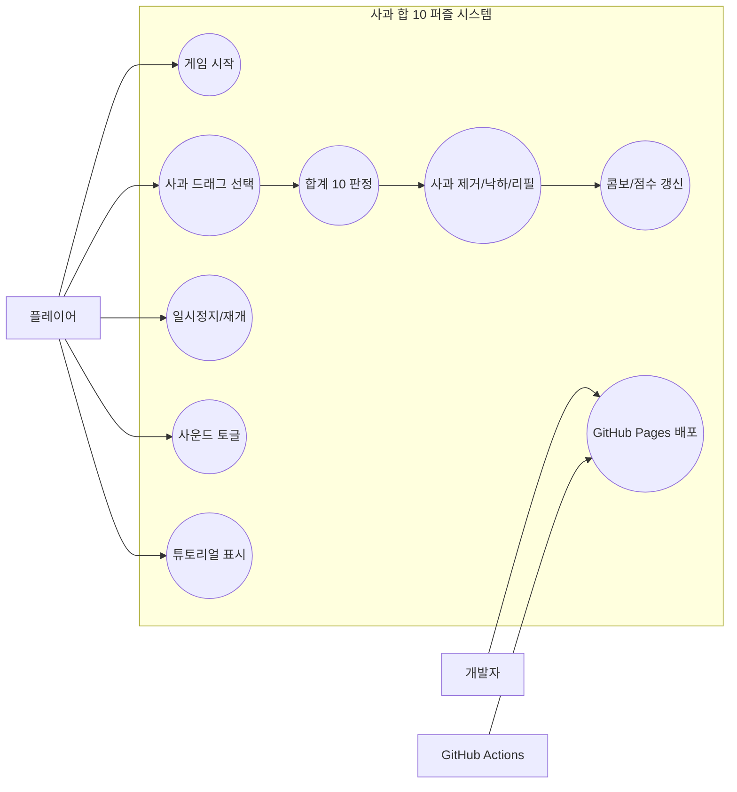
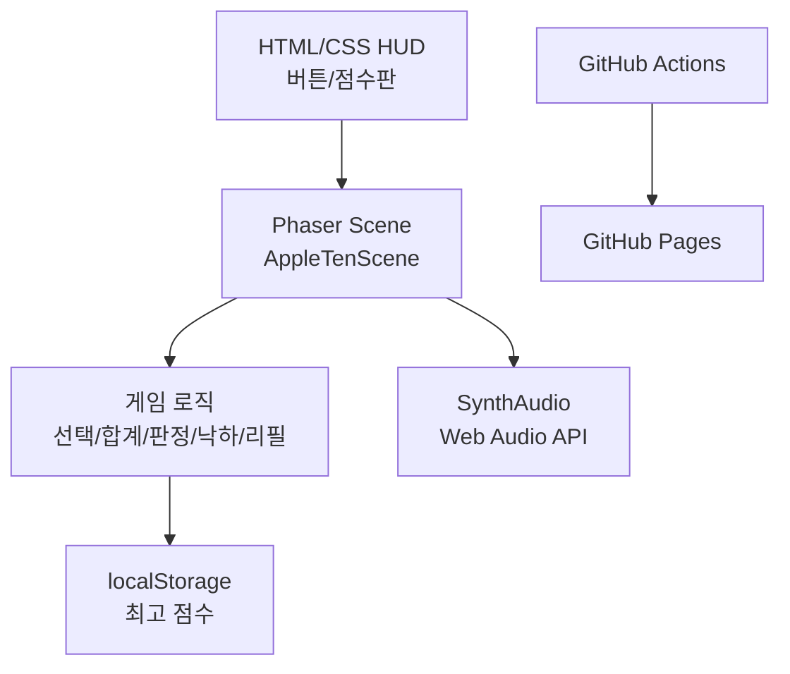
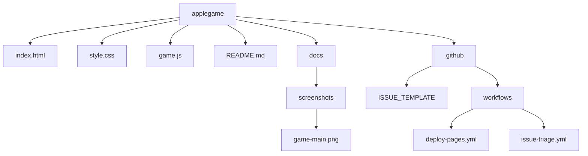

# 사과 합 10 퍼즐

사과 합 10 퍼즐은 숫자(1~9)가 적힌 사과를 드래그로 선택해 합을 정확히 10으로 만들면 제거되고, 위에 있는 사과가 아래로 떨어져 빈칸을 채우는 퍼즐 게임입니다.

브라우저에서 즉시 플레이할 수 있는 정적 웹 게임으로 구성되어 있으며, 간단한 규칙 대비 높은 몰입감과 연속 콤보의 타격감을 목표로 제작했습니다.

## 0) 스크린샷

### 메인 플레이 화면


## 1) 프로젝트 소개

### 핵심 재미 포인트
- 드래그 경로 설계: 인접 제약 없이 자유롭게 사과를 연결
- 정확한 합 계산: 합이 정확히 10일 때만 제거
- 즉각적인 피드백: 파티클, 흔들림, 점수 팝업, 콤보 메시지
- 리듬감 있는 진행: BGM + 성공/실패 효과음

### 게임 규칙 요약
- 보드 크기: 6 x 8
- 숫자 범위: 1~9
- 성공 조건: 드래그로 선택한 숫자 합이 10
- 실패 처리: 합이 10이 아니면 선택 해제
- 진행 방식: 무한 플레이

## 2) 사용 기술

### 프론트엔드
- HTML5
- CSS3
- Vanilla JavaScript (ES6+)
- Phaser 3 (CDN 로드)

### 게임/오디오
- Phaser Scene 기반 렌더링 및 입력 처리
- Phaser Tween/Particles/Camera Shake로 임팩트 효과 구현
- Web Audio API 기반 합성 BGM/SFX 생성

### 협업/운영
- Git + GitHub Issues (이슈 기반 작업)
- GitHub Actions
  - 이슈 트리아지 자동화
  - GitHub Pages 자동 배포

## 3) 코드 핵심 유스케이스 다이어그램

아래 다이어그램은 실제 코드 흐름을 중심으로 한 주요 유스케이스를 나타냅니다.



## 3-1) 아키텍처 다이어그램



## 3-2) 파일 구조 다이어그램



## 4) 코드 핵심 포인트

### 입력 및 게임 상태 제어
- 시작/멈추기/재시작 버튼으로 상태를 제어합니다.
- 시작 전 튜토리얼 오버레이를 표시하고 시작 시 페이드 아웃합니다.
- 일시정지 상태에서는 입력을 잠그고 상태 오버레이를 노출합니다.

### 합계 판정 및 보드 갱신
- 드래그 선택 경로의 숫자 합을 누적합니다.
- 합이 10이면 선택된 셀을 제거하고, 열 단위로 아래로 당긴 뒤 상단 신규 셀을 생성합니다.
- 합이 10이 아니면 선택 상태를 초기화하고 실패 피드백을 제공합니다.

### 점수/콤보 시스템
- 성공 시 선택 길이와 콤보 배수로 점수를 계산합니다.
- 콤보 단계에 따라 메시지를 한국어로 다르게 출력합니다.
- 최고 점수는 localStorage에 저장되어 새로고침 후에도 유지됩니다.

### 숫자 분포 가중치
- 숫자 생성은 균등 난수가 아니라 가중치 기반 난수를 사용합니다.
- 합 10 조합을 더 자주 만들 수 있도록 분포를 조정해 게임 템포를 개선했습니다.

### 오디오 엔진
- Web Audio API로 합성 BGM/SFX를 생성합니다.
- 일시정지 시 BGM 페이드 아웃, 재개 시 페이드 인을 적용합니다.
- 음소거 토글 시 BGM/SFX 게인을 즉시 조정합니다.

## 5) 배포 방식 (GitHub Pages)

### 배포 전략
- main 브랜치에 push되면 GitHub Actions가 자동으로 Pages를 배포합니다.
- 정적 파일(index.html, style.css, game.js)을 dist로 복사해 아티팩트로 업로드합니다.
- Deploy 단계에서 Pages 환경으로 릴리스합니다.

### 배포 URL
- https://progh2.github.io/applegame-copilot/

### 관련 워크플로
- .github/workflows/deploy-pages.yml
- .github/workflows/issue-triage.yml

## 6) 로컬 실행 방법

1. 저장소 클론
2. 루트 경로에서 index.html 열기
3. 또는 간단한 정적 서버로 실행

예시:

```bash
python3 -m http.server 8000
```

브라우저에서 http://localhost:8000 접속

## 7) 이슈 기반 개발 프로세스

현재 프로젝트는 이슈를 먼저 만들고 작업하는 흐름으로 운영합니다.

1. 이슈 생성 (목표/완료조건 명시)
2. 구현 및 검증
3. 커밋에 이슈 번호 연결
4. 이슈 코멘트로 결과 남기고 종료

추가로 이슈 템플릿과 자동 분류(라벨/마일스톤) 워크플로가 구성되어 있어 반복 작업을 줄입니다.
